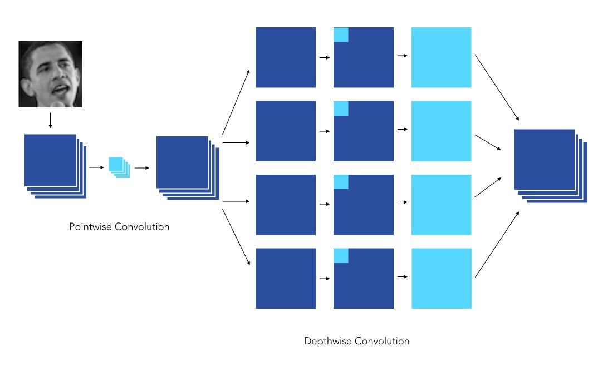
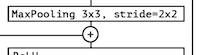
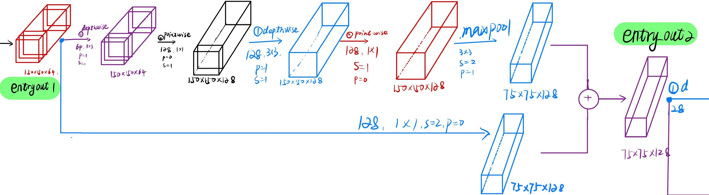
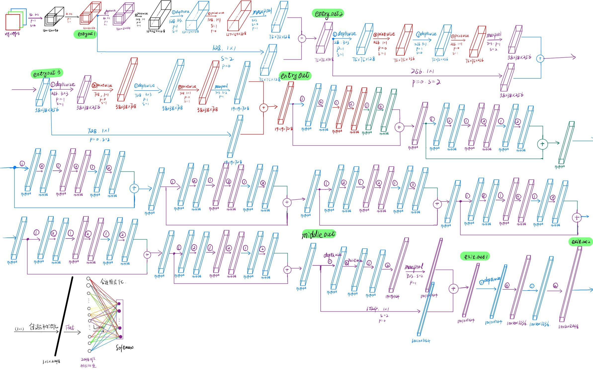
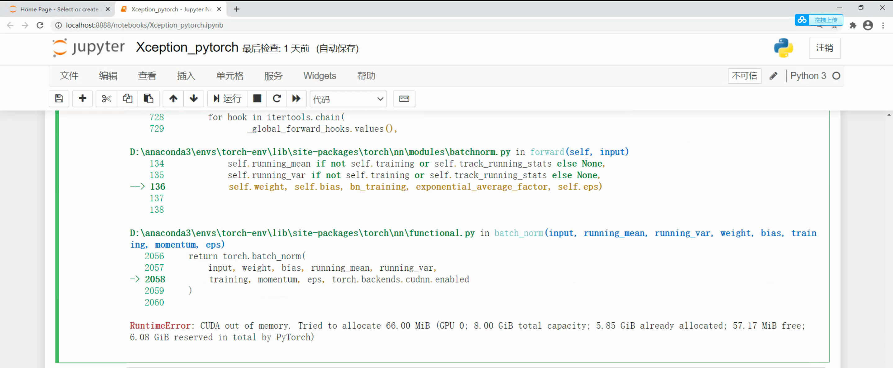
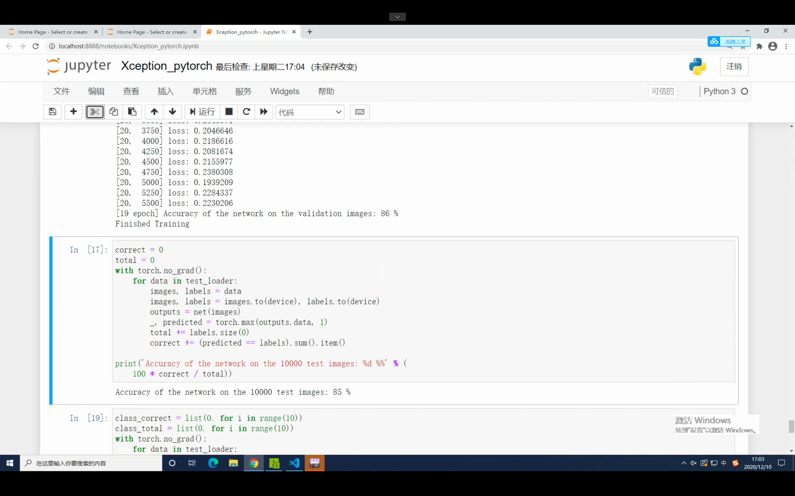
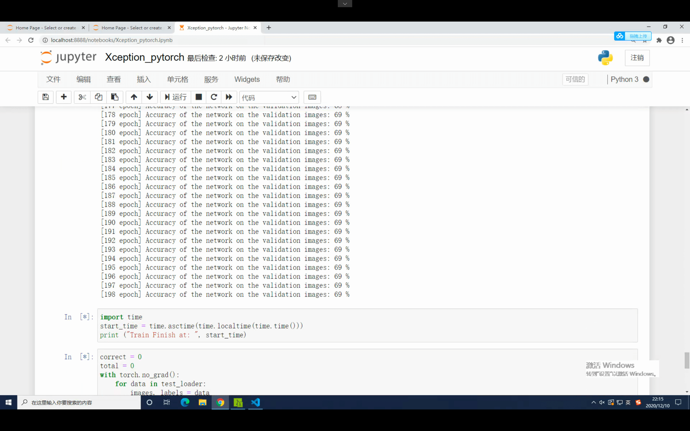
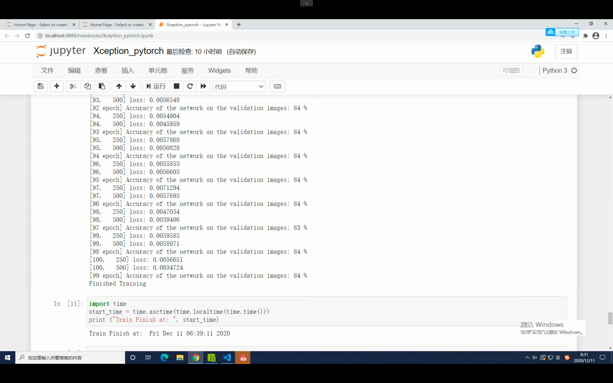
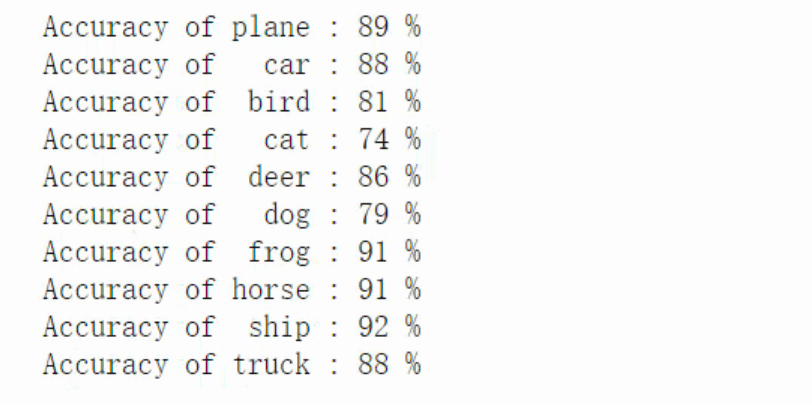

## 可分离卷积



图片来源：https://maelfabien.github.io/deeplearning/xception/#implementation-of-the-xception

```python
class depthwise_separable_conv(nn.Module):
    def __init__(self, nin, nout, kernel_size, padding, bias=False):
        super(depthwise_separable_conv, self).__init__()
        self.depthwise = nn.Conv2d(nin, nin, kernel_size=kernel_size, padding=padding, groups=nin, bias=bias)
        self.pointwise = nn.Conv2d(nin, nout, kernel_size=1, bias=bias)

    def forward(self, x):
        out = self.depthwise(x)
        out = self.pointwise(out)
        return out
```

- 我能跟着网络走一遍，把每一个过程的特征图的 size 给标出来吗？【已解决】

- Xception 的输入是 $[299\times299\times3]$，还有就是遇到了分叉怎么办？【通过阅读源码解决】



答：遇到分叉就是直接相加。

```python
 entry_out2 = self.entry_flow_2(entry_out1) + self.entry_flow_2_residual(entry_out1)
```




## Xception 网络搭建

```python
class depthwise_separable_conv(nn.Module):
    def __init__(self, nin, nout, kernel_size, padding, bias=False):
        super(depthwise_separable_conv, self).__init__()
        self.depthwise = nn.Conv2d(nin, nin, kernel_size=kernel_size, padding=padding, groups=nin, bias=bias)
        self.pointwise = nn.Conv2d(nin, nout, kernel_size=1, bias=bias)

    def forward(self, x):
        out = self.depthwise(x)
        out = self.pointwise(out)
        return out
```

```python
class Xception(nn.Module):
    def __init__(self, input_channel, num_classes=10):
        super(Xception, self).__init__()
        
        # Entry Flow
        self.entry_flow_1 = nn.Sequential(
            nn.Conv2d(input_channel, 32, kernel_size=3, stride=2, padding=1, bias=False),
            nn.BatchNorm2d(32),
            nn.ReLU(True),
            
            nn.Conv2d(32, 64, kernel_size=3, stride=1, padding=1),
            nn.BatchNorm2d(64),
            nn.ReLU(True)
        )
        
        self.entry_flow_2 = nn.Sequential(
            depthwise_separable_conv(64, 128, 3, 1),
            nn.BatchNorm2d(128),
            nn.ReLU(True),
            
            depthwise_separable_conv(128, 128, 3, 1),
            nn.BatchNorm2d(128),
            nn.MaxPool2d(kernel_size=3, stride=2, padding=1)
        )
        
        self.entry_flow_2_residual = nn.Conv2d(64, 128, kernel_size=1, stride=2, padding=0)
        
        self.entry_flow_3 = nn.Sequential(
            nn.ReLU(True),
            depthwise_separable_conv(128, 256, 3, 1),
            nn.BatchNorm2d(256),
            
            nn.ReLU(True),
            depthwise_separable_conv(256, 256, 3, 1),
            nn.BatchNorm2d(256),
            
            nn.MaxPool2d(kernel_size=3, stride=2, padding=1)
        )
        
        self.entry_flow_3_residual = nn.Conv2d(128, 256, kernel_size=1, stride=2, padding=0)
        
        self.entry_flow_4 = nn.Sequential(
            nn.ReLU(True),
            depthwise_separable_conv(256, 728, 3, 1),
            nn.BatchNorm2d(728),
            
            nn.ReLU(True),
            depthwise_separable_conv(728, 728, 3, 1),
            nn.BatchNorm2d(728),
            
            nn.MaxPool2d(kernel_size=3, stride=2, padding=1)
        )
        
        self.entry_flow_4_residual = nn.Conv2d(256, 728, kernel_size=1, stride=2, padding=0)
        
        # Middle Flow
        self.middle_flow = nn.Sequential(
            nn.ReLU(True),
            depthwise_separable_conv(728, 728, 3, 1),
            nn.BatchNorm2d(728),
            
            nn.ReLU(True),
            depthwise_separable_conv(728, 728, 3, 1),
            nn.BatchNorm2d(728),
            
            nn.ReLU(True),
            depthwise_separable_conv(728, 728, 3, 1),
            nn.BatchNorm2d(728)
        )
        
        # Exit Flow
        self.exit_flow_1 = nn.Sequential(
            nn.ReLU(True),
            depthwise_separable_conv(728, 728, 3, 1),
            nn.BatchNorm2d(728),
            
            nn.ReLU(True),
            depthwise_separable_conv(728, 1024, 3, 1),
            nn.BatchNorm2d(1024),
            
            nn.MaxPool2d(kernel_size=3, stride=2, padding=1)
        )
        self.exit_flow_1_residual = nn.Conv2d(728, 1024, kernel_size=1, stride=2, padding=0)
        self.exit_flow_2 = nn.Sequential(
            depthwise_separable_conv(1024, 1536, 3, 1),
            nn.BatchNorm2d(1536),
            nn.ReLU(True),
            
            depthwise_separable_conv(1536, 2048, 3, 1),
            nn.BatchNorm2d(2048),
            nn.ReLU(True)
        )
        
        self.linear = nn.Linear(2048, num_classes)
        
    def forward(self, x):
        entry_out1 = self.entry_flow_1(x)
        entry_out2 = self.entry_flow_2(entry_out1) + self.entry_flow_2_residual(entry_out1)
        entry_out3 = self.entry_flow_3(entry_out2) + self.entry_flow_3_residual(entry_out2)
        entry_out = self.entry_flow_4(entry_out3) + self.entry_flow_4_residual(entry_out3)
        
        middle_out = self.middle_flow(entry_out) + entry_out
        
        for i in range(7):
          middle_out = self.middle_flow(middle_out) + middle_out

        exit_out1 = self.exit_flow_1(middle_out) + self.exit_flow_1_residual(middle_out)
        exit_out2 = self.exit_flow_2(exit_out1)

        exit_avg_pool = F.adaptive_avg_pool2d(exit_out2, (1, 1))                
        exit_avg_pool_flat = exit_avg_pool.view(exit_avg_pool.size(0), -1)

        output = self.linear(exit_avg_pool_flat)
        
        return output
```

画出来了，看了代码之后就很好理解。



我觉得这是一种很好的方式，画一遍之后，对 Xception 的理解更加深刻了。因为现在 Python 和 PyTorch 都不是非常熟悉，还无法直接编程实现，需要参考官方提供的代码。以后学其他的网路结构时，也可以多画画。 

GAP 前一层的输出是多少？

我本次复现的使用代码，我代入求解之后得到的特征图大小为 $10\times10\times2048$。我看到有其他的复现代码最后输出的特征图 size 为 $19\times19\times2048$。

我还不确定我哪一步错了。

## 训练

### 超参数

- batch_size = 8
- EPOCH = 20
- learning_rate = 0.045 ，每两个 EPOCH 后，乘以 0.94 进行学习率衰减

- 数据集 CIFAR-10
- resize 32x32 -> 299x299
- `transforms.Normalize((0.4914, 0.4822, 0.4465), (0.2470, 0.2435, 0.2616))])`
- 训练集划分出 10% 的验证集
- `optimizer = optim.SGD(net.parameters(), lr=lr, momentum=0.9)`

第一次训练，按照论文，输入的 size 为 $299\times299$ ，我只能使用 BatchSize = 8，稍大一点就非常容易 CUDA out of memory。



我使用了 `batch size = 8`，EPOCH = 20，跑了差不多有 10 个小时吧。最后得出 10 个类别的平均 ACC 为：

- 训练（验证集）：87%
- 测试（测试集）：85%



观察 LOSS 发现完全没有收敛，如果增加 EPOCH 数，ACC 应该可以正常提升。

LOSS 损失波动较大，我认为应该是 batchsize 太小了，随机梯度下降时才造成了较大的波动。

而且将 Batch Size 增加之后，训练时间可以降低。$299\times299$ 确实有点大了。

### 修改一些超参数

尝试不要 Resize 那么大。观察网络的特征图，以 CIFAR-10 本来的大小 $32\times32$ 输入到 Xception。优化器使用 Adam，EPOCH = 100，Batch size = 128。

```python
import time
start_time = time.localtime(time.time())
print("Train Start at: ", start_time)
```


100 个 EPOCH 训练了 1 个多小时，只有 65% 左右的精度。

### EPOCH = 200

$32\times32$ 的图片确实有点小，增加 BatchSize = 256。100 个 EPOCH 没有首先，LOSS 损失还在下降，增加到 200 个 EPOCH 试试。

跑了有两个小时，ACC 只有 69% 左右。




## $32\times32$ Resize to $128\times128$

> We can see its performance in CIFAR10. First of all, we will resize images to 75x75 which is the minimum size required by Inception v3 to work.
>
> https://colab.research.google.com/github/MatchLab-Imperial/deep-learning-course/blob/master/2020_05_CNN_architectures.ipynb#scrollTo=rxmx-iMnp4Wz

Xception 所能接受的最小输入是：？

batch size = 256，输入为 $128\times128$ ：CUDA out of memory.

batch size = 128，输入为 $128\times128$ ：CUDA out of memory.

batch size = 64，输入为 $128\times128$ 。It's Word!

ACC = 84%。



晚上 22:40 开始跑到第二天早上的 6:40。

 本次实验我还没使用预训练的网络、或者使用上一步训练的网络继续开始。每次都是重新开始，导致浪费了非常多的时间（如加载 ACC=84% 的网络，在此基础之上继续进行迭代优化）。

最后一次实验，使用了 200 EPOCH，大约训练了 16 小时，在最后的 ACC = 87%。



