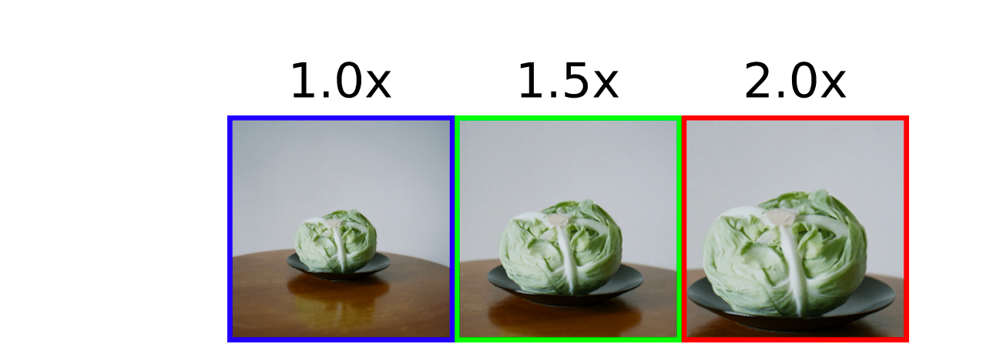
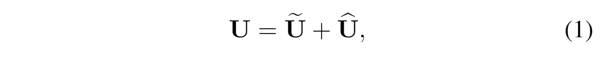

# 论文阅读 Selective Kernel Networks

注意力机制论文阅读，第二次汇报的论文为：

- 下载地址：[（**SKNet**）Selective Kernel Networks (arXiv: 1903.06586)](https://arxiv.org/pdf/1903.06586.pdf)
- 发表时间（e-prints posted on arXiv）：2019 年 03 月.

## Abstract

传统的卷积神经网络中的每一层中的神经元的感受野都是相同的大小。在神经科学领域，视觉皮层神经元的感受野大小是受刺激调节的，这一点在 CNN 中很少被考虑到。

本篇论文设计了一种叫做 ”Selective Kernel Unit“ 的块，使用 softmax attention 融合具有不同卷积核大小的多个分支。 对这些分支的不同关注度使得在融合时神经元的有效感受野大小上的不同。

多个 SK 块的堆叠得到 SKNet，这个名字也是为了致敬 SENet。

SKNet 在 ImageNet、CIFAR 数据集上都取得了 SOTA。

详细的实验分析表明，SKNet 中的神经元可以捕获具有不同比例的目标对象，实验验证了神经元根据输入自适应地调整其感受野大小的能力。

## 1. Introduction

在视觉皮层中，同一区域中神经元的感受野大小是不同的，这使得神经元可以在同一处理阶段收集多尺度的空间信息。下图就是相同目标对象的不同尺度。

让神经元可以在同一处理阶段收集多尺度的空间信息的机制，已经广泛被采用。InceptionNet 就是其中一个例子，它通过设计一个简单的级联（concatenation）来聚合来自内部 1×1、3×3、5×5、7×7 卷积核的多尺度信息。

许多的实验证明，神经元的感受野大小不是固定的，而是受刺激调节的。InceptionNet 是一种在同一层具有多尺度信息的模型，但是这种机制比较的固定，不同分支的多尺度信息的汇聚方法也比较的简单，可能不足以为神经元提供强大的适应能力。

本篇论文提出了一种方法，从多种卷积核中聚集信息，以实现神经元的自适应感受野大小。论文的作者将 SKNet 的核心描述为一句话：用 multiple scale feature 汇总的 information 来 channel-wise 地指导如何分配侧重使用哪个 kernel 的表征。

SKNet 的核心是 “Selective Kernel”（SK）卷积，它由三种操作组成：*Split、Fuse* 和 *Select*。 

- Split：生成具有各种内核大小的多个路径，这些大小对应于神经元的不同感受野大小。
- Fuse：组合并汇总来自多个路径的信息，以获得选择权重的全局和全面表示。
- Select：根据选择权重聚合大小不同的内核的特征图。

最后，为了**验证所提出的模型能够自适应调节神经元感受野大小**，论文作者通过放大自然图像中的目标对象并缩小背景以保持图像大小不变来模拟刺激。发现当目标对象变得越来越大时，大多数神经元从更大的核分支路径中收集的信息越来越多（权重越大）。这些结果表明，SKNet 中的神经元具有自适应的感受野大小。

## 2. Related Work

**（1）多分支的卷积网络**

- Highway、ResNet、InceptionNet...

**（2）Grouped/depthwise/dilated convolutions**

- 分组卷积：AlexNet、ResNeXt...
- 深度可分离卷积：Xception、MobileNetV1、MobileNetV2、ShuffleNet...
- 空洞卷积

**（3）注意力机制**

SKNet 第一个通过引入注意力机制来明确关注神经元的自适应感受野大小。

**（4）Dynamic Convolution**

- Spatial Transform Networks...

## 3. 解析 Selective Kernel Convolution

> SKNet：用 multiple scale feature 汇总的 information 来 channel-wise 地指导如何分配侧重使用哪个 kernel 的表征。
>
> - adaptively adjust their RF sizes. 自适应的调整其感受野的大小。
>

**SK 模块所做的工作**是：输入的特征图为 $X \in \mathbb{R}^{H \times W \times C}$，**经过 SK Convolution** 后，得到输出的特征图为 $V \in \mathbb{R}^{H \times W \times C}$。SK 卷积有 3 个步骤：***Split, Fuse and Select***.

### 3.1 SK Convolution: *Split* (1/3)

对于输入的特征图 $X \in \mathbb{R}^{H \times W \times C}$，默认情况下进行两次转换：

**（1）$\tilde{F}: X \rightarrow \tilde{U} \in \mathbb{R}^{H \times W \times C}$**

卷积核的大小为 $3 \times 3$。

**（2）$\hat{F}: X \rightarrow \hat{U} \in \mathbb{R}^{H \times W \times C}$**

卷积核的大小为 $5\times 5$。为了进一步提高效率，$5 \times 5$ 的卷积使用空洞大小为 2 的 $3 \times 3$ 的卷积来替代。

### 3.2 SK Convolution: *Fuse* (2/3)

Fuse 操作和 Squeeze and Excitation block 一样。

**（1）integrate information from all branches.**

将分支进行 element-wise 的求和，得到 $U \in \mathbb{R}^{H \times W \times C}$。

**（2）global average pooling.**

得到 $s \in \mathbb{R}^{C \times 1}$，s 是一个有 C 个元素的列向量。

**（3）compact feature by simple fully connected (fc) layer.**

使用全连接层，即 $s \in \mathbb{R}^{C \times 1} \rightarrow z \in \mathbb{R}^{d \times 1}$，其中 $d < C$。

- $\delta$ 使用 ReLU 函数，
- $B$ 表示 Batch Normalization，
- $W \in \mathbb{R}^{d \times C}$，权重矩阵。
- z 被称为 compact feature descriptor.

- reduction ratio $r$ 是一个超参数，
- 一般设置 L = 32。

### 3.3 SK Convolution: *Select* (3/3)

这一步是 SK Block 的核心操作。

> A **soft attention across channels** is used to adaptively select different spatial scales of information, which is guided by the compact feature descriptor z.

（1）Soft attention across channels.

- $A, B \in \mathbb{R}^{C \times d}$，这两个矩阵也是端到端训练出来的。如果只有两个分支，那么矩阵 B 是冗余的，因为 Softmax 的输出 $a_c + b_c = 1$，可以通过 1 减去另一个得到。
- $z \in \mathbb{R}^{d \times 1}$，经过 softmax 操作后，得到的 $a \in \mathbb{R}^{C \times 1}$.
  - z 被称为 compact feature descriptor.
  - a 被称为 soft attention vector.

（2）The final feature map $V$ is obtained through the **attention weights** on various kernels.

- $\tilde{U}, \hat{U} \in \mathbb{R}^{H \times W \times C}$
- $a, b \in \mathbb{R}^{C \times 1}$
- 执行的操作是 element-wise product.  $a_c \cdot \tilde{U}_c$ 表示第 c 个通道的特征图上的每个点，都乘以数 $a_c$。

综上，就是 SK Convolution 的内部原理细节。

## 4. Experiments

### 4.1 ImageNet Classification

#### SKNet 与 state-of-the-art 的比较（1/4）

Table2 显示了，在 ImageNet Classification 任务上，SKNet 与各种 state-of-the-art 模型的比较。

首先将 SKNet-50 和 SKNet-101 与具有相似模型复杂性的模型进行比较。结果表明，在类似的参数量和计算量下，SKNets 始终能够达到最高的性能。

- ResNeXt-101 的参数量比 SKNet-50 大 60％，计算量大 80％，但 SKNet-50 的性能却比 ResNeXt-101 高出 0.32％ 以上。
- 与 InceptionNets 相比，SKNet 的复杂程度相近或更低，SKNets 的性能提高了1.5％ 以上。
- 与同行 SENet 相比，SKNet 使用较少的参数，SKNets 可以获得比 SENet 低 0.3-0.4％ 的错误率。

#### SKNet 与 ResNeXt的比较： Selective Kernel vs. Depth/Width/Cardinality.（2/4）

Table 3 显示了，与 ResNeXt（使用 32×4d 的设置）相比，SKNets 不可避免地会引入一些参数和计算上的增加。

为了公平地比较 ResNeXt 和 SKNet，通过更改 ResNeXt 的深度、宽度和基数来增加其复杂性，以匹配 SKNets 的复杂性。结果显示，ResNeXt 模型复杂度的提升能够带来更低的错误率。

在参数量和计算量相近的情况下，SKNet 依旧是表示得最好的。

#### SKNet 与其他模型的参数量与性能情况（3/4）

Figure 2 显示了，SKNet 的 top-1 错误率相对于其参数数量的关系。

#### SKNet 与轻量级模型的比较（4/4）

Table 4. 显示了，SK 卷积不仅能够在 baseline 的基础之上提升性能，而且比 SENet 要更好。表明了 SK 卷积应用在低端设备上的巨大潜力。

## 4.1 CIFAR

Table 5 显示了，在相同的 backbone（ResNeXt-29, 16 × 32d）下，

- SKNet 的性能优于 ResNeXt，并且参数量减少了 60%
- SKNet 始终优于 SENet，并且参数量减少了 22%

## 4.3 消融研究 Ablation Studies

#### dilation D（1/2）

Table 6 显示了，在 ImageNet 数据集上，如下两种具有相同感受野的卷积核：

- kernel size 5×5，空洞 D=1
- kernel size 3×3，空洞 D=2

各种 3×3 kernels with various dilations 明显优于与它具有相同感受野的 kernel。3×3, D=3 优于 7×7, D=1。

#### 各种不同 Kernel 的结合（1/2）

研究分支数 M 的影响。

Table 7 中，

- K3：标准了 3×3 卷积核
- K5：3×3 with dilation 2
- K7：3×3 with dilation 3

结果表明：

（1）随着分支数 M 的增加，top-1 错误率下降了。

（2）无论 M=2 或者 M=3，SK 的多路聚合始终比简单的聚合方法的 top-1 错误率更低。

（3）M=2，M=3 的 top-1 错误率差不多（20.79%，20.76%）。为了更好的平衡模型的性能和复杂度，M = 2 是更好的选择。

## 4.4 Analysis and Interpretation

上图 Figure3 (a)(b)，以两个随机的样本为例，对于大多数通道，当目标对象增大（1.0×、1.5×、2.0×），大核（5×5）的注意力权重增加，红线大部分位于蓝绿两线之上。

> ❓3×3 的也增加了呢？为什么没有画出来进行对照！
>
> 答：因为只有两个分支，5×5 分支的注意力增加了，3×3 分支的注意力就必须减小，两分支的 soft attention vector 相加和为 1。

(c) 图显示了所有验证图像的平均值，红线（2.0×）大部分位于蓝绿两线之上。

论文中的另一个发现是：

- 目标对象越大，则在网络浅层和中层阶段（例如，SK 2_3，SK 3_4），“Selective Kernel” 机制将把更多的注意力分配给更大的内核，条形图中粉色的条值最大（a,b 中的 2_3、3_4 阶段）。但是，在更深的层上（例如，SK 5_3），就没有这种规律性了。

  > 但是相减后为负值，5×5 的注意力仍小于 3×3 的注意力，但是 5×5 的注意力随目标对象的增大而增大。

  - (a) 中在 SK 5_3 阶段，5×5 核的注意力减去 3×3，在 1.5× 和 2.0× 的目标对象上，得到的值非常接近（注意力相近），表明网络并不偏向于选择更大的卷积核还是更小的卷积核。
  - (b) 中在 SK 5_3 阶段就是很乱了，绿条比蓝条小，表明目标对象从 1.0× 放大到 1.5× 后，网络把注意力分配给了更小的 3×3 核；而粉条比绿条大，表明对标对象从 1.5× 放大到 2.0× 后，网络把注意力分给了更大的 5×5 核。
  - 因此，在深层的网络中，对于不同尺度的目标对象，网络对于选择怎么样的核没有什么规律。

论文做了一个实验，对于每个类别，各取 50 张图片，针对 1.0× 和 1.5× 的目标对象绘制平均注意力差异（5×5 的注意力权重减去 3×3 的）。

如 Figure 4 所示，观察到以前的现象适用于所有 1,000个 类别，其中，随着目标对象规模的增长，5×5 核的重要性持续且同时增加。（浅层和中层橙色线始终位于蓝色线之上）

> 都是负值，是不是代表着 5×5 卷积核的注意力都小于 3×3 的注意力。是的，但是这个图想要说明的是 5×5 随目标对象的增大而增大。

这表明，在网络的早期，可以根据对象大小的语义意识来选择适当的内核大小，从而可以有效地调整这些神经元的感受野大小。

但是，这种现象在像 SK 5_3 这样的非常深的层中不存在了。橙蓝两线交错表示 5×5 的注意力权重减去 3×3 的注意力权重的差时正时负。
