# SENet 和它的孪生兄弟 SKNet

✅ 论文地址：

- Squeeze-and-Excitation Networks: [https://arxiv.org/pdf/1709.01507.pdf](<https://arxiv.org/pdf/1709.01507.pdf>)
- Selective Kernel Networks: [https://arxiv.org/pdf/1903.06586.pdf](<https://arxiv.org/pdf/1903.06586.pdf>)

✅ 论文发表时间（arXiv V1）

- SENet：2017 年 9 月 5 日
- SKNet：2019 年 3 月 15 日

## 相关的论文

（1）Inception 系列（2014 年~2016 年）：Inception 结构中嵌入了多尺度信息，聚合多种不同感受野上的特征来获得性能增益。

- Inception V1 (GoogLeNet): 11 Sep 2014
- Inception V2 (Batch Normalization): 11 Feb 2015
- Inception V3: 2 Dec 2015
- Inception V4: 23 Feb 2016
- Xception: 7 Oct 2016

（2）ResNet （10 Dec 2015）

（3）ResNeXt（16 Nov 2016）

（4）Inside-Outside Network（14 Dec 2015）：网络中考虑了空间中的上下文信息。

（5）Spatial Transform Network（5 Jun 2015）：Attention 机制引入到空间维度。

-   - Dynamic Capacity Network（24 Nov 2015）

**（6）💢 SENet（5 Sep 2017）：通道注意力**

（7）CBAM（17 Jul 2018）：空间注意力+通道注意力相结合

**（8）💢SKNet（15 Mar 2019）**

## SENet

> 一作：胡杰，关于 SENet 中文介绍：
>
> - Momenta 详解 ImageNet 2017 夺冠架构 SENet  [https://www.sohu.com/a/161633191_465975](<https://www.sohu.com/a/161633191_465975>)

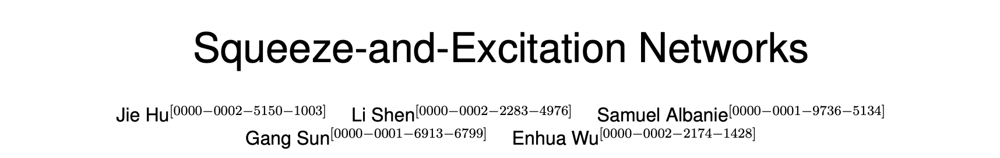

🌀通道间的特征都是平等的吗？SENet 给出了这个问题的答案。

论文的主要工作是：考虑特征通道之间的关系，提出了 Squeeze-and-Excitation Networks（简称 SENet）。显式地建模特征通道之间的相互依赖关系，通过学习的方式来自动获取到每个特征通道的重要程度，然后依照这个重要程度去提升有用的特征并抑制对当前任务用处不大的特征。

SE block 如下 Fig. 1 所示。


### SQUEEZE-AND-EXCITATION BLOCKS

Squeeze 和 Excitation 是两个非常关键的操作。

给定一个输入 $X$，$X \in  \mathbb{R}^{C' \times H' \times W'}$，通过一系列卷积等一般变换 $F_{tr}$ 后，得到一个 $U \in \mathbb{R}^{C \times H \times W}$ 的特征图。

接下来通过一个 Squeeze and Excitation block ，三个操作来重标定前面得到的特征。

（1）Squeeze: $F_{sq}(\cdot)$

首先是 Squeeze 操作，顺着空间维度来进行特征压缩，将每个二维的特征通道变成一个实数，这个实数某种程度上具有全局的感受野，并且输出的维度和输入的特征通道数相匹配。

即：对 $C \times H \times W$ 的特征图进行 global average pooling，得到 $1 \times 1 \times C$ 的特征图。

$$z_c = F_{sq}(u_c) = \frac{1}{H \times W} \sum_{i=1}^{H} \sum_{j=1}^{W} u_c{(i, j)}$$

（2）Excitation: $F_{ex}(\cdot , W)$

通过参数 W 来为每个特征通道生成权重，其中参数 W 被学习用来显式地建模特征通道间的相关性。

即：使用一个全连接层神经网络，对 Squeeze 之后的结果进行一个非线性变换。

$$s = F_{ex}(z, W) = \sigma(g(z, W)) = \sigma(W_2 \delta(W_1 z)) $$

（3）Scale

最后是一个 Reweight 的操作，将 Excitation 的输出的权重看做是进过特征选择后的每个特征通道的重要性，然后通过乘法逐通道加权到先前的特征上，完成在通道维度上的对原始特征的重标定。

$$\tilde{x} = F_{scale}(u_c, s_c) = s_c u_c$$

### SE Block 实现细节

使用 global average pooling 作为 Squeeze 操作；

紧接着两个 Fully Connected 层组成一个 Bottleneck 结构去建模通道间的相关性，并输出和输入特征同样数目的权重。

首先将特征维度降低到输入的 1/16，（降低计算量，16 是实践得到的较好的超参数）

然后经过 ReLu 激活后再通过一个 Fully Connected 层升回到原来的维度。（增加非线性）

通过一个 Sigmoid 函数获得 0~1 之间归一化的权重。

最后通过一个 Scale 的操作来将归一化后的权重加权到每个通道的特征上。

SE Block 可以嵌入到现在几乎所有的网络结构中。

### 实例 Instantiations

通过在原始网络结构的 building block 单元中嵌入 SE 模块，可以获得不同种类的 SENet。如 SE-BN-Inception、SE-ResNet、SE-ReNeXt、SE-Inception-ResNet-v2 等等。

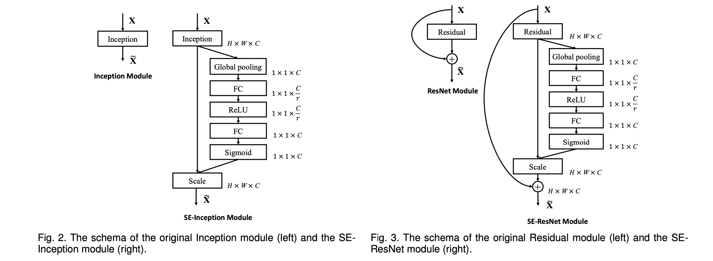

### SENet 的参数量和计算量情况

SENet 额外的模型参数都存在于 Bottleneck 设计的两个 Fully Connected 中。

以  SE-ResNet-50 和 ResNet-50 为例，从理论上，SE Block 增长的额外计算量仅仅不到 1%。

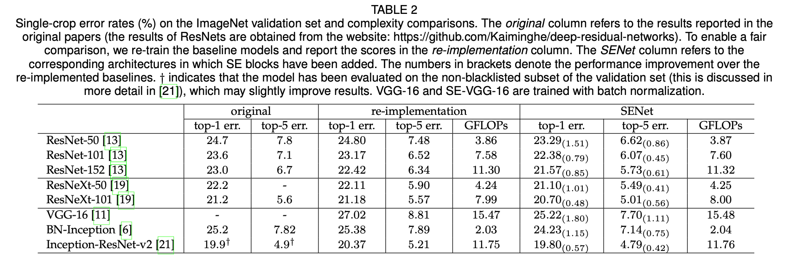

## SENet 的表现

ResNet-50、ResNet-101、ResNet-152 和嵌入 SE 模型的结果。SE-ResNets 在各种深度上都远远超过了其对应的没有 SE 的结构版本的精度，这说明无论网络的深度如何，SE 模块都能够给网络带来性能上的增益。

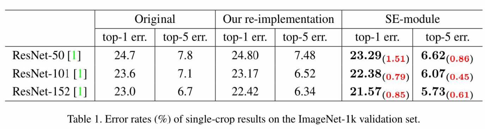

SE 模块嵌入到 ResNeXt、BN-Inception、Inception-ResNet-v2 上均获得了不菲的增益效果，加入了 SE 模块的网络收敛到更低的错误率上。

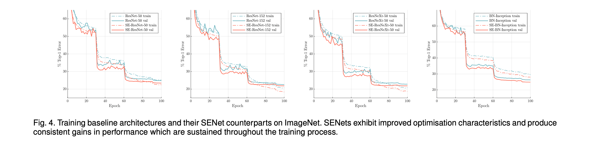

其他（CIFAR-10、CIFAR-100、Places365、COCO、ImageNet）：

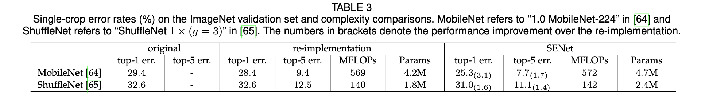

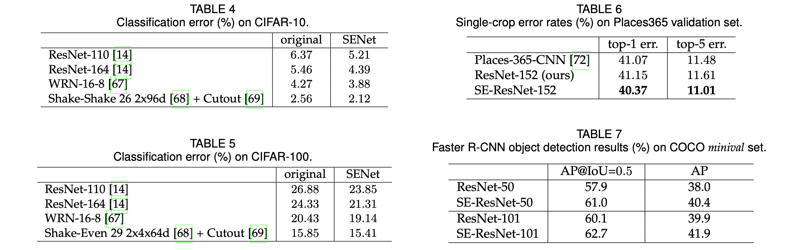

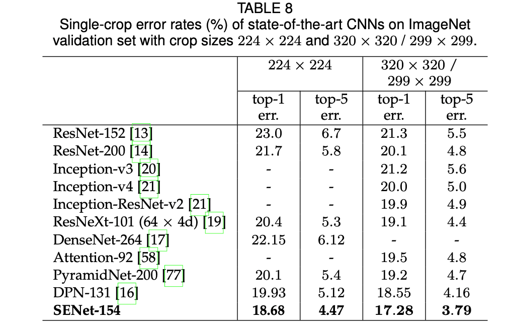

最后，在 ILSVRC 2017 竞赛中，SENet 在测试集上获得了 2.251% Top-5 错误率。对比于去年第一名的结果 2.991%，获得了将近 25% 的精度提升。

> 2012~2017： ILSVRC 2017 竞赛冠军🏆：
>
> - 2012，AlexNet：top-5: 15.32%
> - 2013，Clarifai，top-5: 11.20%
> - 2014，GoogleNet v1，top-5: 6.67%
> - 2015，ResNet，top-5: 3.57%
> - 2016，Trimps-Soushen（公安三所），top-5: 2.99%
> - 2017，**SENet**，top-5: 2.25%

## ❌ SKNet

> 一作：李翔，在知乎谈 SKNet：
>
> - 「SKNet——SENet 孪生兄弟篇」：[https://zhuanlan.zhihu.com/p/59690223](https://zhuanlan.zhihu.com/p/59690223)

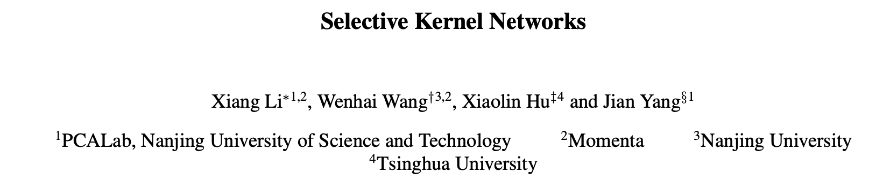

SKNet 我留下周进行汇报（1 月 29 日）。

## 实验

对 ResNet50、SENet50 和 SKNet 50 进行简单的比较。

数据集采用 CIFAR-10。

除了 model 不同，三者其他训练时的参数都是一致的。

训练时保存 checkpoint，这样调参就不用每次都从 0 开始训练。有一个经过预训练的模型能减少训练需要的时间。

```python
if args.resume:
    # Load checkpoint.
    print('==> Resuming from checkpoint..')
    assert os.path.isdir('checkpoint'), 'Error: no checkpoint directory found!'
    checkpoint = torch.load('./checkpoint/ckpt.pth')
    net.load_state_dict(checkpoint['net'])
    best_acc = checkpoint['acc']
    start_epoch = checkpoint['epoch']
```

总训练 **200 epoch**，每两个 epoch 保存一次 checkpoint，使用 matplotlib 绘制 rain_acc 和 test_acc 曲线。

ResNet50 训练 200 个 Epoch。下图为 ResNet50 训练结束，Test Acc 达到 95.41%。 

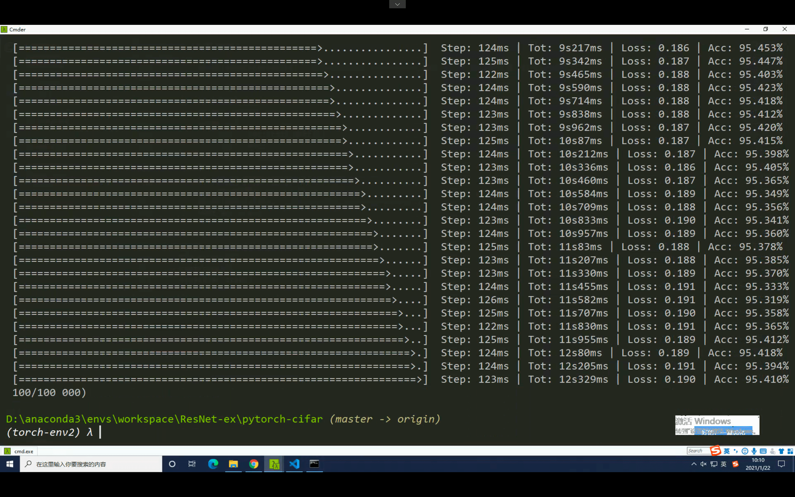

每 2 个 epoch 保存一次 checkpoint，用于绘图。（忘记修改了，其实不需要保存 net.state_dict 的，非常耗空间。）

> 我把 loss 忘记保存了🌚，loss 曲线也很重要。我只保存了 acc 和 epoch。

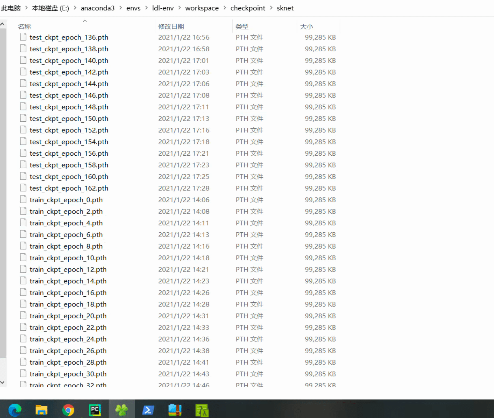

不保存 `state_dict` ，只保存 loss、epoch 和 acc。


### 1. ResNet50

> - 参考代码链接：[https://github.com/kuangliu/pytorch-cifar](<https://github.com/kuangliu/pytorch-cifar>)

```python
'''ResNet in PyTorch.
For Pre-activation ResNet, see 'preact_resnet.py'.
Reference:
[1] Kaiming He, Xiangyu Zhang, Shaoqing Ren, Jian Sun
    Deep Residual Learning for Image Recognition. arXiv:1512.03385
'''
import torch
import torch.nn as nn
import torch.nn.functional as F


class BasicBlock(nn.Module):
    expansion = 1

    def __init__(self, in_planes, planes, stride=1):
        super(BasicBlock, self).__init__()
        self.conv1 = nn.Conv2d(
            in_planes, planes, kernel_size=3, stride=stride, padding=1, bias=False)
        self.bn1 = nn.BatchNorm2d(planes)
        self.conv2 = nn.Conv2d(planes, planes, kernel_size=3,
                               stride=1, padding=1, bias=False)
        self.bn2 = nn.BatchNorm2d(planes)

        self.shortcut = nn.Sequential()
        if stride != 1 or in_planes != self.expansion*planes:
            self.shortcut = nn.Sequential(
                nn.Conv2d(in_planes, self.expansion*planes,
                          kernel_size=1, stride=stride, bias=False),
                nn.BatchNorm2d(self.expansion*planes)
            )

    def forward(self, x):
        out = F.relu(self.bn1(self.conv1(x)))
        out = self.bn2(self.conv2(out))
        out += self.shortcut(x)
        out = F.relu(out)
        return out


class Bottleneck(nn.Module):
    expansion = 4

    def __init__(self, in_planes, planes, stride=1):
        super(Bottleneck, self).__init__()
        self.conv1 = nn.Conv2d(in_planes, planes, kernel_size=1, bias=False)
        self.bn1 = nn.BatchNorm2d(planes)
        self.conv2 = nn.Conv2d(planes, planes, kernel_size=3,
                               stride=stride, padding=1, bias=False)
        self.bn2 = nn.BatchNorm2d(planes)
        self.conv3 = nn.Conv2d(planes, self.expansion *
                               planes, kernel_size=1, bias=False)
        self.bn3 = nn.BatchNorm2d(self.expansion*planes)

        self.shortcut = nn.Sequential()
        if stride != 1 or in_planes != self.expansion*planes:
            self.shortcut = nn.Sequential(
                nn.Conv2d(in_planes, self.expansion*planes,
                          kernel_size=1, stride=stride, bias=False),
                nn.BatchNorm2d(self.expansion*planes)
            )

    def forward(self, x):
        out = F.relu(self.bn1(self.conv1(x)))
        out = F.relu(self.bn2(self.conv2(out)))
        out = self.bn3(self.conv3(out))
        out += self.shortcut(x)
        out = F.relu(out)
        return out


class ResNet(nn.Module):
    def __init__(self, block, num_blocks, num_classes=10):
        super(ResNet, self).__init__()
        self.in_planes = 64

        self.conv1 = nn.Conv2d(3, 64, kernel_size=3,
                               stride=1, padding=1, bias=False)
        self.bn1 = nn.BatchNorm2d(64)
        self.layer1 = self._make_layer(block, 64, num_blocks[0], stride=1)
        self.layer2 = self._make_layer(block, 128, num_blocks[1], stride=2)
        self.layer3 = self._make_layer(block, 256, num_blocks[2], stride=2)
        self.layer4 = self._make_layer(block, 512, num_blocks[3], stride=2)
        self.linear = nn.Linear(512*block.expansion, num_classes)

    def _make_layer(self, block, planes, num_blocks, stride):
        strides = [stride] + [1]*(num_blocks-1)
        layers = []
        for stride in strides:
            layers.append(block(self.in_planes, planes, stride))
            self.in_planes = planes * block.expansion
        return nn.Sequential(*layers)

    def forward(self, x):
        out = F.relu(self.bn1(self.conv1(x)))
        out = self.layer1(out)
        out = self.layer2(out)
        out = self.layer3(out)
        out = self.layer4(out)
        out = F.avg_pool2d(out, 4)
        out = out.view(out.size(0), -1)
        out = self.linear(out)
        return out


def ResNet18():
    return ResNet(BasicBlock, [2, 2, 2, 2])

def ResNet34():
    return ResNet(BasicBlock, [3, 4, 6, 3])

def ResNet50():
    return ResNet(Bottleneck, [3, 4, 6, 3])

def ResNet101():
    return ResNet(Bottleneck, [3, 4, 23, 3])

def ResNet152():
    return ResNet(Bottleneck, [3, 8, 36, 3])

```

### 2. SENet50

基于 ResNet50，加入 SE block 就得到了 SENet50。

```python
import torch
import torch.nn as nn
import torch.nn.functional as F


class BasicBlock(nn.Module):
    
    expansion = 4
    
    def __init__(self, in_planes, planes, stride=1):
        super(BasicBlock, self).__init__()
        self.conv1 = nn.Conv2d(in_planes, planes, kernel_size=1, bias=False)
        self.bn1 = nn.BatchNorm2d(planes)
        self.conv2 = nn.Conv2d(planes, planes, kernel_size=3,stride=stride, padding=1, bias=False)
        self.bn2 = nn.BatchNorm2d(planes)
        self.conv3 = nn.Conv2d(planes, self.expansion * planes, kernel_size=1, bias=False)
        self.bn3 = nn.BatchNorm2d(self.expansion*planes)

        self.shortcut = nn.Sequential()
        if stride != 1 or in_planes != self.expansion*planes:
            self.shortcut = nn.Sequential(
                nn.Conv2d(in_planes, self.expansion*planes,
                          kernel_size=1, stride=stride, bias=False),
                nn.BatchNorm2d(self.expansion*planes)
            )

        # SE layers
        self.fc1 = nn.Conv2d(self.expansion*planes, self.expansion*planes//16, kernel_size=1)  # Use nn.Conv2d instead of nn.Linear
        self.fc2 = nn.Conv2d(self.expansion*planes//16, self.expansion*planes, kernel_size=1)

    def forward(self, x):
        out = F.relu(self.bn1(self.conv1(x)))
        out = self.bn2(self.conv2(out))
        out = self.bn3(self.conv3(out))

        # Squeeze
        w = F.avg_pool2d(out, out.size(2))
        w = F.relu(self.fc1(w))
        w = F.sigmoid(self.fc2(w))
        # Excitation
        out = out * w  # New broadcasting feature from v0.2!

        out += self.shortcut(x)
        out = F.relu(out)
        return out

class SENet(nn.Module):
    def __init__(self, block, num_blocks, num_classes=10):
        super(SENet, self).__init__()
        self.in_planes = 64

        self.conv1 = nn.Conv2d(3, 64, kernel_size=3, stride=1, padding=1, bias=False)
        self.bn1 = nn.BatchNorm2d(64)
        self.layer1 = self._make_layer(block,  64, num_blocks[0], stride=1)
        self.layer2 = self._make_layer(block, 128, num_blocks[1], stride=2)
        self.layer3 = self._make_layer(block, 256, num_blocks[2], stride=2)
        self.layer4 = self._make_layer(block, 512, num_blocks[3], stride=2)
        self.linear = nn.Linear(512*block.expansion, num_classes)

    def _make_layer(self, block, planes, num_blocks, stride):
        strides = [stride] + [1]*(num_blocks-1)
        layers = []
        for stride in strides:
            layers.append(block(self.in_planes, planes, stride))
            self.in_planes = planes * block.expansion
        return nn.Sequential(*layers)

    def forward(self, x):
        out = F.relu(self.bn1(self.conv1(x)))
        out = self.layer1(out)
        out = self.layer2(out)
        out = self.layer3(out)
        out = self.layer4(out)
        out = F.avg_pool2d(out, 4)
        out = out.view(out.size(0), -1)
        out = self.linear(out)
        return out


def SENet50():
    return SENet(BasicBlock, [3,4,6,3])
```

SENet50 相比于 ResNet50，理论上计算量增加不到 1%，但是我实际训练时，耗时加倍（ ≈ 一天一夜）。

### 3. SKNet50

> SKNet 的实现参考：[https://github.com/developer0hye/SKNet-PyTorch/blob/master/sknet.py](<https://github.com/developer0hye/SKNet-PyTorch/blob/master/sknet.py>)

### 绘制 ResNet50、SENet50、SKNet50 的 Acc 曲线

四个网络，各 200 各 Epoch 真的很耗时间。

```python
# 获取 acc 随 epoch 增加的值
total_epoch = 200

resnet_test_acc = []
resnet_train_acc = []
for i in range(0, total_epoch, 2):
    checkpoint = torch.load(resnet_path+"\\train_ckpt_epoch_%s.pth" % str(i))
    acc = checkpoint['acc_train']
    resnet_train_acc.append(acc)
    
    checkpoint = torch.load(resnet_path+"\\test_ckpt_epoch_%s.pth" % str(i))
    acc = checkpoint['acc_test']
    resnet_test_acc.append(acc)
```

（1）ResNet50：Acc 随 epoch 变换曲线

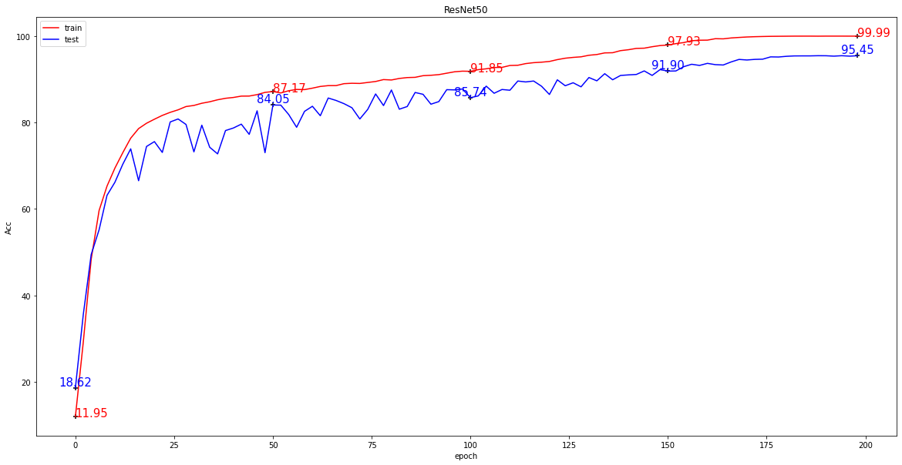

ResNet 表现得那么好，倒是让我感觉很奇怪。ResNet 论文中，在 CIFAR-10 数据集上，测试得到 ResNet44 的表现为 92.83%，ReNet56 的表现为 93.03%。

如上实现的 ResNet50 在测试集上的表现竟然达到了 95.45%。

（2）SENet50

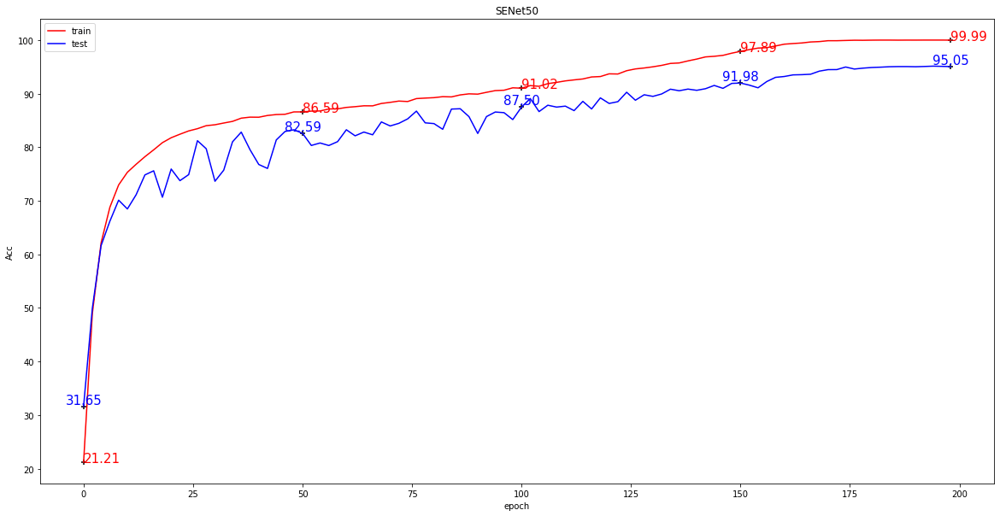

- SENet18

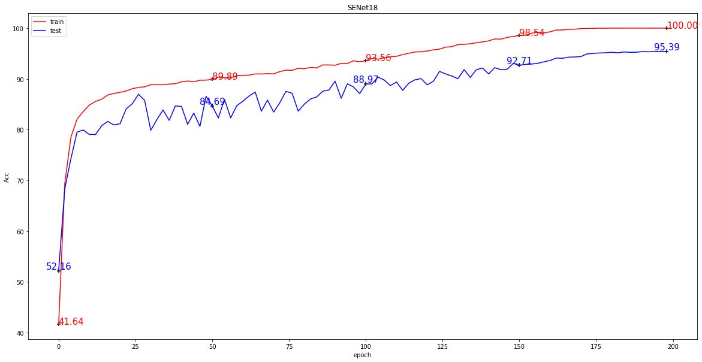

（3）SKNet50

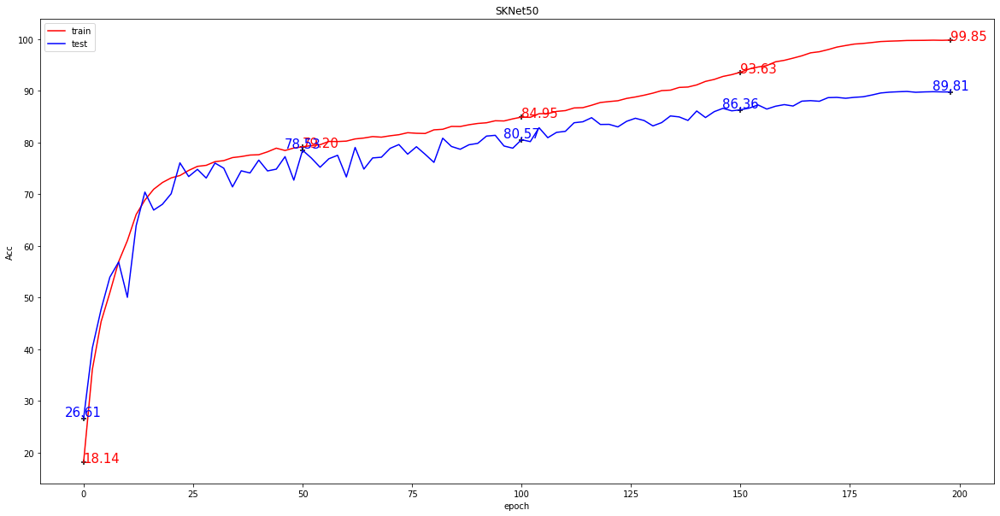

整合到一张图片上，方便直观的进行比较。

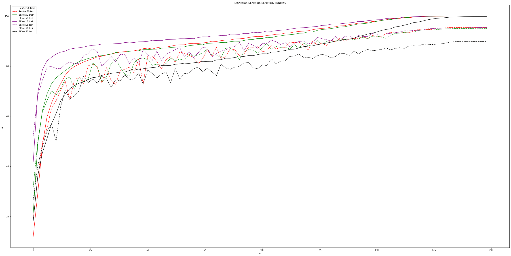

从理论上分析，各网络的表现情况应该是：

ResNet50 < SENet50 < SKNet50.

但是我复现的实践结果为： ResNet50(95.45%) > SENet50(95.05%) > SKNet50(89.81)。

问题出现在哪里？

## 参数调优

进行一系列的参数调优，目标是实现 ResNet50 < SENet50 < SKNet50.

待解决的问题：

- （1）ResNet50 表现得那么好，有问题吗？
- （2）SENet18 竟然优于 SENet50，这个很有问题！

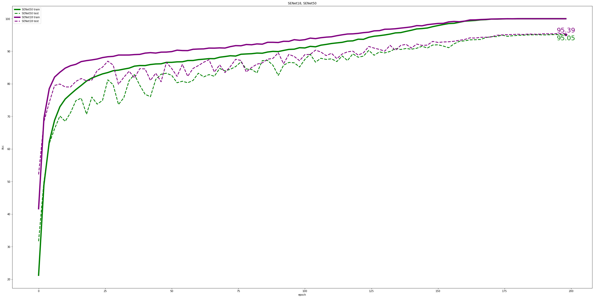

- （3）SKNet50 竟然没有上 90%，这个很有问题！下周再解决吧。

