# VERY DEEP CONVOLUTIONAL NETWORKS FOR LARGE-SCALE IMAGE RECOGNITION

> 本周（2020.11.23-2020.11.27）阅读的论文是 VGG。

VGG 名称的来源：**V**isual **G**eometry **G**roup, Department of Engineering Science, University of Oxford.

[论文地址:https://arxiv.org/pdf/1409.1556.pdf](https://arxiv.org/pdf/1409.1556.pdf)

## ABSTRACT

论文研究了在大规模图像识别中卷积网络的**深度**对其精度的影响。

使用 $3\times3$ 的卷积核。

网络深度提升到了 16-19层。

获得了 2014 ImageNet Challenge 的 localistion 和 classification 的第一名和第二名。（分类任务的第一名是 GoogLeNet）

## 1 INTRODUCTION

卷积网络（ConvNets）最近在大规模图像图像和视频识别方面取得了巨大的成功。

ImageNet 大规模视觉识别挑战赛（ILSVRC）在推进深度视觉识别架构方面发挥了重要作用。

ConvNets 目前大多数人已经尝试的改进方式：

- 利用了较小的接收窗口尺寸和较小的第一卷积层步幅（ smaller receptive window size and
  smaller stride of the first convolutional layer.）
- 在整个图像和多个尺度上密集地训练和测试网络（training and testing the networks densely over the whole image and over multiple scales.）

本篇论文的工作是固定网络的结构的其他参数，使用 $3\times3$ 的卷积核，增加更多的卷积层来增加网络的深度。

> we fix other parameters of the architecture, and steadily increase the depth of the network by adding more convolutional layers, which is feasible due to the use of very small (3 × 3) convolution filters in all layers.

提出了精度更高的 ConvNets 架构，不仅在 ILSVRC 的 Classification 和 Localisation 任务上达到了最高的准确度，而且还适用于其他图像识别的数据集。

## 2 CONVNET CONFIGURATIONS

### 网络结构

- 网络输入的图片尺寸是 $224\times224$
- 预处理：每个像素中减去在训练集上计算的平均 RGB 值
- 卷积核大小为 $3\times3$，还有 $1\times1$ 可以看作是输入通道的线性变换
- 卷积的步幅（Stride）固定为 1 像素（pixel）
- 有 5 个最大池化层，并非每个卷积层后面都接着一个最大池化层。最大池化的窗口为 $2\times2$，步幅为 2
- 不同的网络架构，卷积层的深度不相同
- 卷积层最后接着 3 个全连接层，前两个有 4096 个通道，最后是一个 1000 的 ILSVRC 分类（Softmax）。
- 所有的隐藏层都使用 ReLU 激活函数
- 摒弃了 LRN， Section 4 实验证实了 LRN 不会提高 ILSVRC 数据集的性能

## 6 个网络

A、A-LRN、B、C、D、E 这个 6 网络只在深度上有所不同，其他的都采用通用的设计。

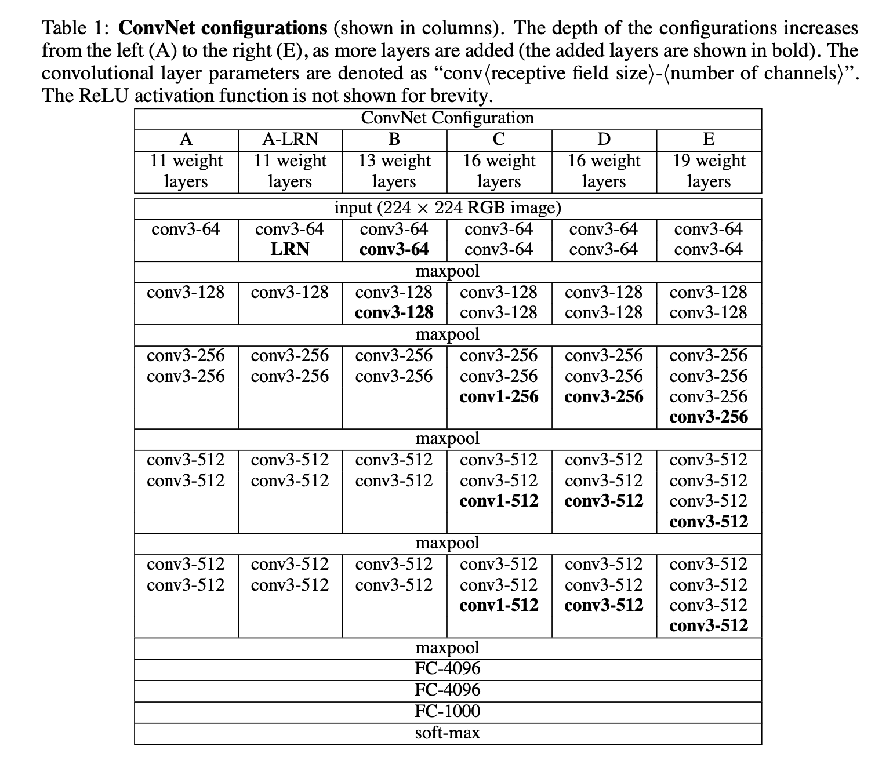

网络深度越深，参数越多。尽管深度很大，但是网络的参数并没有大很多。

> In spite of a large depth, the number of weights in our nets is not greater than the number of weights in a more shallow net with larger conv. layer widths and receptive fields (144M weights in [Sermanet et al., 2014]).

### 网络更细致讨论

整个网络中使用 $3\times3$ 的感受野（receptive fields）。

两个 $3\times3$ 的 conv. 层的堆叠（中间没有池化）的有效感受野为 $5\times5$。（画一画就理解了）

三个这样的层堆叠的有效感受野为 $7\times7$。

通过使用三个 $3\times3$ conv. 层的堆叠而不是只使用一个 $7\times7$ 层，有什么好处呢？

-  `more discriminative`.（怎么翻译？）
- 具有更少的参数（怎么算的，C 为什么要平方？）

表 1 的 C 网络，使用了 $1\times1$ 的卷积。$1\times1$ 卷积本质上是对相同维度空间的线性投影，但引入了额外的非线性。

Goodfellow 等人将深度 ConvNets （11 个权重层）应用于街号识别的任务中，得出结论：深度的增加带来了更好的性能。

GoogLeNet 是 ILSVRC-2014 分类任务的第一名。

本篇论文的模型在单网分类精度方面优于 GoogLeNet。（Section 4.5，啥是单网分类？）

> our model is outperforming that of [Szegedy et al.(2014)] in terms of the single-network classification accuracy.

## 分类评估细节

### 训练 TRAINING

- Momentum Mini-batch 梯度下降
- batch size=256
- momentum 参数为 0.9
- 权重衰减（L2 正则化 $5\times10^{-4}$）和 Dropout 正则化（丢弃率为 0.5）
- 学习率初始为 0.01。学习率衰减：精度停止提升时，学习率减少 10 倍，总共减少 3 次。
- 74 个 epochs

虽然比 AlexNet 更深，但是由于：

- 更小一些的卷积核 conv. 带来的正则化效果
- 某些层的预初始化

网络将收敛的更快。

权重的初始化非常重要，初始化不好使得深层网络中梯度的不稳定而导致学习停滞。论文中 A 结构比较浅，因此可以使用均值为 0、方差为 0.01 的高斯分布进行随机初始化，偏置则可以初始化为零。

数据增强与 AlexNet 相同，随机裁剪 $224\times224$， random horizontal flipping and random RGB colour shift。

S 被称为训练规模（we also refer to S as the training scale）。如果 S = 224，那么裁剪到的是整张图像；如果 $S\ll 224$ ，裁剪到的将是图像的一小部分。

- S = 256 广泛使用，如（AlexNet，GoogLeNet）。首先训练网络时使用 S=256，在训练 S=384 时，用 S = 256 预先训练的权重进行初始化。
- 从 $[S_{min}, S_{max}]$ 随机抽取（$S_{min} = 256, S_{max}=512$）。识别目标可能这图像的任何位置，因此这是非常有益的。规模抖动的训练集增强。

### 测试 TESTING

一个训练好的 ConvNet 和输入图片。 

- 输入图片缩放到一个 Q（Q 测试尺度 scale，不一定等于 S。对每个 S 使用不同的 Q 可以提升性能）
- 全连接层转换为卷积层（第一个 FC 层转换为 $7\times7$ conv. 层，最后两个 FC 层转换为 $1\times1$ conv. 层）
- 将得到的网络应用于未裁剪的图像。
- 结果是一个通道数量等于类数量的类分数映射，空间分辨率可变，取决于输入图像的大小。
- 可以通过通过水平翻转图像来对测试集进行数据增强。

全卷积网络是应用在整个图像上的，因此不需要在测试时对多个 crops 进行采样。

使用大量的 crops，可以提升精度，与完全卷积网络相比，它可以对输入图像进行更精细的采样。当将 ConvNet 应用于一个 crop 时，卷积的特征图会被填充为零。

注：crop 即裁剪的意思。

**PS：这一小节我没看懂。**

### 实现细节

基于开源的 C++ Caffe toolbox 实现，但是进行的修改，使得能够使用多 GPU 并行 ，以及在多个 scales 的全尺寸（未裁剪）图像上进行训练和评估。

每 batch 的训练图像分割成多个 GPU batch，在每个 GPU 上并行处理来进行。在计算完 GPU batch 梯度后，对它们进行平均，得到所有 batch 的梯度。梯度计算是在各个 GPU 上同步进行的，所以结果和在单个 GPU 上训练时的结果是完全一样的。

在配备 4 个 NVIDIA Titan Black GPU 的系统上，根据架构的不同，训练一个网络需要 2-3 周的时间。

## 分类实验

上述的 ConvNet 架构在 ILSVRC-2012 数据集上实现的图像分类结果。

这个数据集包括 1000 个类的图像。

- 训练集（130 万张)
- 验证集（5 万张)
- 测试集（10 万张带有保留类标签的图像）。

分类性能的评估采用两个衡量标准：top-1 和 top-5 误差。（这两个指标我在 AlexNet 论文笔记中有说明）

ILSVRC-2014 比赛的 "VGG" 团队。

### 4.1 SINGLE SCALE EVALUATION

对于固定的 S，Q = S 和抖动的 $S ∈ [S_{min}，S_{max}]$，Q = 0.5($S_{min}+S_{max}$)。结果如下表：

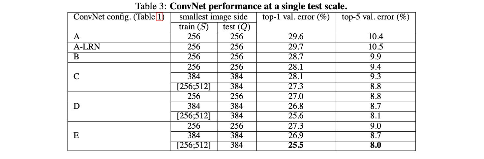

- A 和 A-LRN 的结果说明，LRN 没有多大的用处。
- 分类误差随着层数的加深而降低，A（11 层）到 E（19 层）
- B 和 C 的结果说明，加入非线性层对精度提升有一定的帮助
- C 和 D 的层数相同，C 包含一些 $1\times1$ 的卷积核，D 全部都是 $3\times3$。$3\times3$ 能捕捉更多的上下文信息。$3\times3$ 论文中称为 filters with non-trivial receptive fields 
- 深度达到 19 层时，错误率会达到饱和，更深的模型可能需要大的数据集

两个 $3\times3$ 与一个 $5\times5$ 具有相同的感受野。将 B 网络中的每对 $3\times3$ 替换为单个 $5\times5$，替换后的网络的 top-1误差比 B 的 top-1 误差高 7%。

使用  $S ∈ [S_{min}，S_{max}]$ 相比固定 S 来说更优，证实了通过尺度抖动（scale jittering ）的训练集增强确实有助于捕捉多尺度的图像统计数据。

### 4.2 MULTI-SCALE EVALUATION

评估测试时尺度抖动的对模型的影响。

- $Q=\{S-32, S, S+32\}$
- 训练时的尺度抖动使得网络在测试时可以应用于更大范围的尺度，
- 用可变 $S∈[S_{min},S_{max}]$ 训练的模型在更大范围的尺寸上进行评估 $Q=\{S_{min}, 0.5(S_{min}+S_{max}), S_{max}\}$

测试时的规模抖动（scale jittering）会带来更好的性能（和 Table 3 一起看）。测试集上，网络 E 实现了  7.3% 的 top-5 错误了。

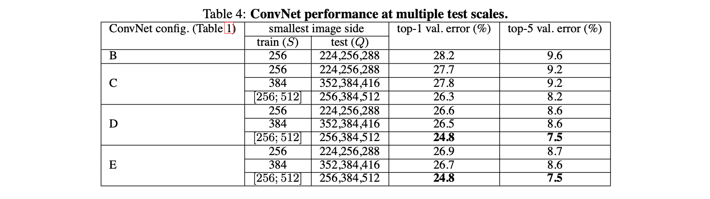

### 4.3 MULTI-CROP EVALUATION

dense 和 multi-crop 两种方法是互补的。单独来看，后者相对较优，两者的组合比单独要更优。

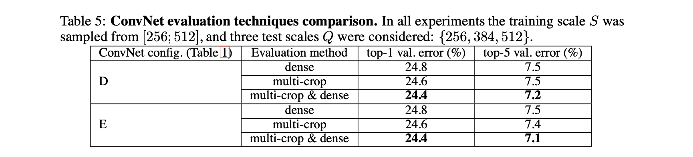

### 4.4 多模型结合

结合各网络的输出，对 Softmax 的值进行平均，能提升模型的性能。

Table 5 中，表现最好的单一模型实现了 7.1% 的 top-5 误差（模型E）。结合 D 和 E 这个两个网络，测试的 top-5 误差降到了 7.0%。

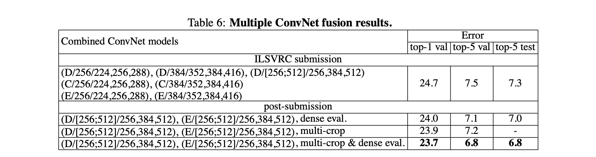

### 4.5 与现有的技术进行比较

在 ILSVRC-2014 挑战赛的分类任务中，本篇论文 VGG 团队使用 7 个网络模型的集合，以 7.3% 的测试误差获得了第 2 名。过后，使用 D 和 E 模型的结合将错误率降低到 6.8%。

与分类任务的第一名（GoogLeNet，错误率为 6.7%）相比也有竞争力，并且大大超过了 ILSVRC-2013 的冠军 Clarifai。

VGG 的最佳结果只结合了两个模型来实现，比大多数 ILSVRC 提交的作品中使用的模型要少得多。

在单网性能方面，VGG 做到了最好（7.0% 的测试误差），GoogLeNet 是 7.9%。（In terms of the single-net performance, our architecture achieves the best result (7.0% test error), outperforming a single GoogLeNet by 0.9%. ）

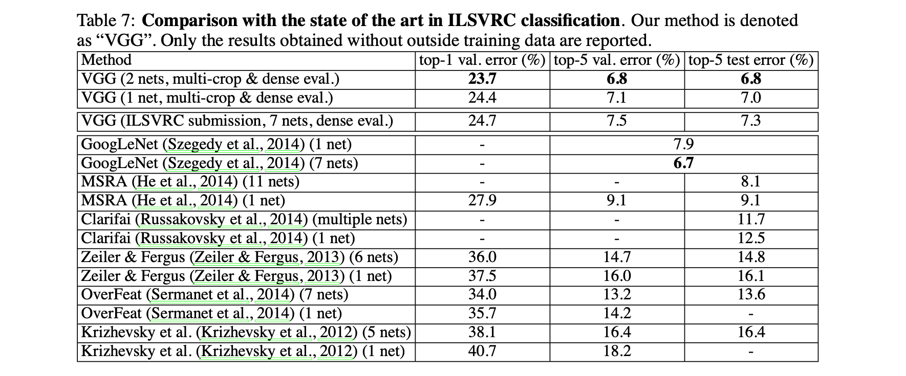

## 总结

VGG 使用传统的 ConvNet 架构（LeNet, AlexNet），在大幅增加深度的情况下，在 ImageNet 挑战数据集上取得了最好的成绩。

模型可以很好地应用到数据集中。

再次证实了深度在视觉表征中的重要性。

---

## LOCALISATION（定位）

VGG 在 2014 年的 ILSVRC 挑战赛的定位任务，误差为 25.3%。

### 定位网络 LOCALISATION CONVNET

训练：

- 使用 D 网络结构（Table 1），VGG-16。

- 最后一个全连接层预测边界框的位置。边界框由一个 4-D 向量表示，存储着中心坐标、宽度和高度。

- 损失函数采用 Euclidean loss
- S = 256 和 S = 384
- 使用上面的分类模型进行初始化，最后的全连接层进行随机初始化
- 学习率初始化为 0.001

测试：

- 只考虑对 ground truth class 对边界框预测（Ground truth 是正确标注的数据）
- 仅应用于图像的中心裁剪，获得边界框

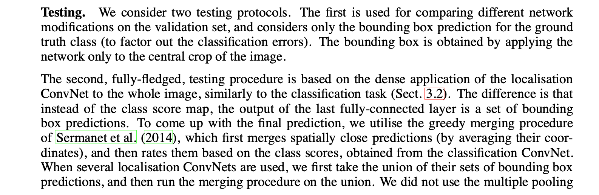

**PS：TESTING 部分好难看懂～**前面也是。。。

### 实验

如果 IOU（intersection over union）大于 0.5，则认为预测的边界框是正确的。

per-class regression（PCR）

single-class regression（SCR）

- PCR 的表现优于 SCR
- 全部 fine-tuning 比只 fine-tuning 第一第二个全连接层要好

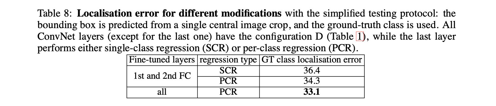

与只进行中心裁剪相比，将网络应用与整张图像能提升精确率。

25.3% 的测试误差，VGG 团队赢得了 ILSVRC-2014 挑战赛的 localisation 任务的冠军。比 ILSVRC-2013 的冠军 Overfeat 的结果要好得多，而且 VGG 还有没采用分辨率增强等技术，VGG 还有一定的提升空间。

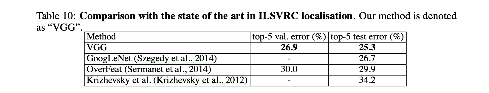

## GENERALISATION OF VERY DEEP FEATURES

在 ILSVRC 数据集上预先训练一个 ConvNets，然后应用到其他数据集上。

- 去掉最后一个全连接层（1000 类的 Softmax）；
- 使用倒数第二层的 4096 维的激活值作为图像的特征；
- 经过 L2 归一化，并与线性 SVM 分类器相结合，在目标数据集上进行训练。

VGG 与其他方法在 VOC-2007、VOC-2012、Caltech-101和 Caltech-256 上的图像分类结果如下表。

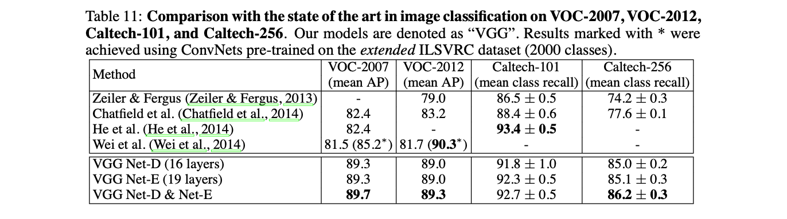

VOC-2007 图像数据集包含 10K 张图像，VOC-2012 包含 22.5K 张。每张图像都被标注了一个或几个标签，对应 20 个对象类别。识别性能采用各类平均精度（mAP）来衡量。

(Wei et al., 2014) 的方法在 VOC-2012 上的 mAP 相比 VGG 高 1%。这是通过在 2000 类 ILSVRC 数据集上进行预训练，其中包括额外的 1000 个类别，语义上与 VOC 数据集中的类别接近，并且采用了对象检测辅助分类流水线（bject detection-assisted classification pipeline.），因此取得了更好的结果。

Caltech-101 数据集包含 9K 图像，有 102 个类（101 个对象类别和一个背景类）。Caltech-256 有 31K 图像，257 个类别。

VGG 在 Caltech-101 数据集上相比何恺明等人的方法稍差一些，但是 VGG 在 VOC-2007 上明显优于何恺明等人。

在 PASCAL VOC-2012 动作分类任务上，VGG 使用 D&E 结合，与的比较如下表。

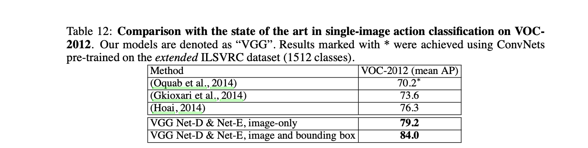

VGG 仅仅依靠非常深的卷积特征的表示能力，就取得了第一名的成绩。

VGG 广泛的应用于其他的图像识别任务，并且始终优于更浅层的表示。

**PS：对于这些数据集训练和测试的细节我没有做笔记，需要了解直接看论文**

完。

